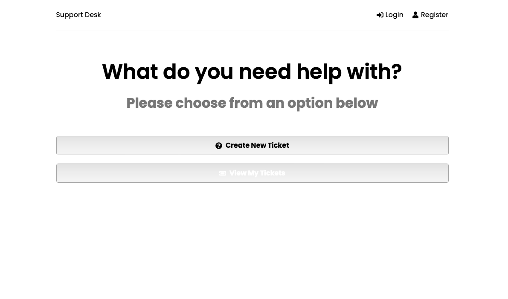

# Tech Support Desk App

#### Made with

  

    <h2>Tech Support Desk App</h2>
     
    <h4>A place to get help.<h4>
     
     
    <a href="https://github.com/billycwong19/support-desk"><strong>Explore the docs »</strong></a>
     
     
    <a href="https://tech-support-desk.herokuapp.com/">View Site</a>
    ·
    <a href="https://github.com/billycwong19/support-desk/issues">Report Bug</a>
    ·
    <a href="https://github.com/billycwong19/support-desk/issues">Request Feature</a>
  

  
Table of Contents

  <ol>
    <li>
      <a href="#about-the-project">About</a>
    </li>
      <ul>
        <li><a href="#license">License</a></li>
        <li><a href="#contact">Contact</a></li>
        <li><a href="#references">Contact</a></li>
      </ul>
    </li>
  </ol>

## About The Project

    

A simple and intuitive help desk for technology or any other number of professions where a queue of tickets is required. With few changes, we can mold this into many different types of applications. Please submit any changes you would like to see.<a href="https://tech-support-desk.herokuapp.com/"> View Site Here</a>.

(<a href="#top">back to top</a>)

### License

Distributed under the MIT License. See `LICENSE.txt` for more information.

(<a href="#top">back to top</a>)

### References

Made with the help of Brad Taversey via his React Udemy course. 

Badges from https://github.com/Ileriayo/markdown-badges 

(<a href="#top">back to top</a>)

## Contact

Website coded by William Wong
 
Email: billycwong19@gmail.com

Portfolio: [https://billycwong19.github.io/portfolio/](https://billycwong19.github.io/portfolio/)

(<a href="#top">back to top</a>)

